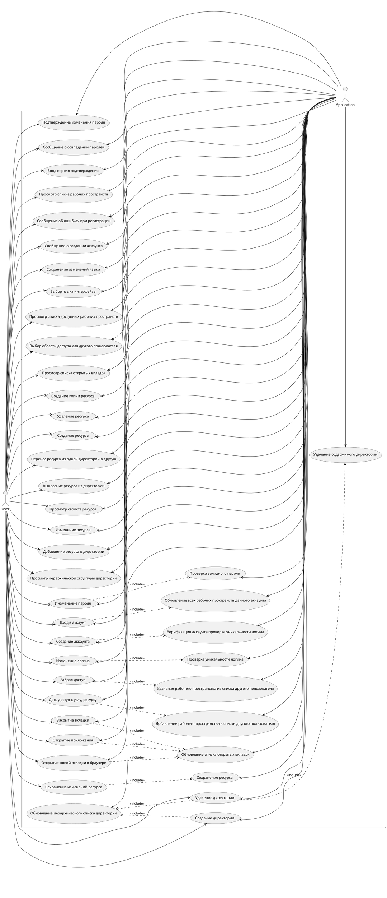

```plantuml
@startuml

:User: as User
:Application: as Application

rectangle  {
	
    (Создание директории) as Create
    (Просмотр иерархической структуры директории) as View
	(Обновление иерархического списка директории) as Update
	(Удаление директории) as Delete
	(Удаление содержимого директории) as Delete_include
	
	(Добавление ресурса в директории) as Add_folder
	(Изменение ресурса) as Change_file
	(Сохранение изменений ресурса) as Save_change_file
	(Сохранение ресурса) as Save_file
	(Просмотр свойств ресурса) as View_character
	
	(Вынесение ресурса из директории) as Move_file
	(Перенос ресурса из одной директории в другую) as Move_file_folder
	
	(Создание ресурса) as Create_note
	
	(Удаление ресурса) as Delete_note
	
	(Создание копии ресурса) as Double_note
	
	(Открытие приложения) as Open_app
	(Обновление списка открытых вкладок) as Update_tab
	(Просмотр списка открытых вкладок) as View_tab
	(Открытие новой вкладки в браузере) as Open_tab
	(Закрытие вкладки) as Close_tab

	(Выбор области доступа для другого пользователя) as Choice_aria
	(Дать доступ к узлу, ресурсу) as Give_aria
	(Просмотр списка доступных рабочих пространств) as View_aria
	(Добавление рабочего пространства в списке другого пользователя) as   Add_work_aria

	(Забрал доступ) as Take_aria
	(Удаление рабочего пространства из списка другого пользователя) as Delete_aria

	(Выбор языка интерфейса) as Language
	(Сохранение изменений языка) as Save_change

	(Вход в аккаунт) as Come_in
	(Обновление всех рабочих пространств данного аккаунта) as Update_accaunt
	(Просмотр списка рабочих пространств) as View_сome_in

	(Инзменение пароля) as Change_pass
	(Проверка валидного пароля) as Valid_pass
	(Ввод пароля подтверждения) as Double_pass
	(Сообщение о совпадении паролей) as Correct_alert
	(Подтверждение изменения пароля) as Done_change

	(Изменение логина) as Change_login
	(Проверка уникальности логина) as Correct_login

	(Создание аккаунта) as Create_accaunt
	(Сообщение о создании аккаунта) as Alert_accaunt
	(Верификация аккаунта проверка уникальности логина) as Correct_accaunt
	(Сообщение об ошибках при регистрации) as Alert_error

	Update <.. Create : <<include>>
	Update <.. Delete : <<include>>
	Delete_include <.up. Delete : <<include>>
	Save_file <.up. Save_change_file : <<include>>
	Update_tab <.up. Open_app : <<include>>
	Update_tab <.up. Open_tab : <<include>>
	Update_tab <.up. Close_tab : <<include>>
	Add_work_aria <.up. Give_aria : <<include>>
	Delete_aria <.up. Take_aria : <<include>>
	Update_accaunt <.up. Come_in : <<include>>
	Valid_pass <.up. Change_pass : <<include>>
	Correct_accaunt <.up. Create_accaunt : <<include>>
	Correct_login <.up. Change_login : <<include>>
}

left to right direction
User -Down-> Create
User -Down-> View
User -Down-> Delete
User -Down-> Add_folder
User -Down-> Change_file
User -Down-> Save_change_file
User -Down-> View_character
User -Down-> Move_file
User -Down-> Move_file_folder
User -Down-> Create_note
User -Down-> Delete_note
User -Down-> Double_note

User -Down-> Open_app
User -Down-> View_tab
User -Down-> Open_tab
User -Down-> Close_tab

User -Down-> Choice_aria
User -Down-> Give_aria
User -Down-> View_aria
User -Down-> Take_aria

User -Down-> Language
User -Down-> Save_change

User -Down-> Come_in
User -Down-> View_сome_in

User -Down-> Change_pass
User -Down-> Double_pass
User -Down-> Correct_alert
User -Down-> Done_change

User -Down-> Change_login
User -Down-> Alert_accaunt
User -Down-> Create_accaunt
User -Down-> Alert_error


Application -up-> Create
Application -up-> View
Application -up-> Update
Application -up-> Delete
Application -up-> Delete_include
Application -up-> Add_folder
Application -up-> Change_file
Application -up-> Save_file
Application -up-> View_character
Application -up-> Move_file
Application -up-> Move_file_folder
Application -up-> Create_note
Application -up-> Delete_note
Application -up-> Double_note
Application -up-> Open_app
Application -up-> Update_tab
Application -up-> View_tab
Application -up-> Open_tab
Application -up-> Close_tab
Application -up-> Choice_aria
Application -up-> Give_aria
Application -up-> View_aria
Application -up-> Add_work_aria
Application -up-> Take_aria
Application -up-> Delete_aria
Application -up-> Language
Application -up-> Save_change
Application -up-> Change_login
Application -up-> Correct_login
Application -up-> Create_accaunt
Application -up-> Alert_accaunt
Application -up-> Correct_accaunt
Application -up-> Alert_error

Application -up-> Come_in
Application -up-> Update_accaunt
Application -up-> View_сome_in
Application -up-> Change_pass
Application -up-> Valid_pass
Application -up-> Double_pass
Application -up-> Correct_alert
Application -up-> Done_change


@enduml
```

